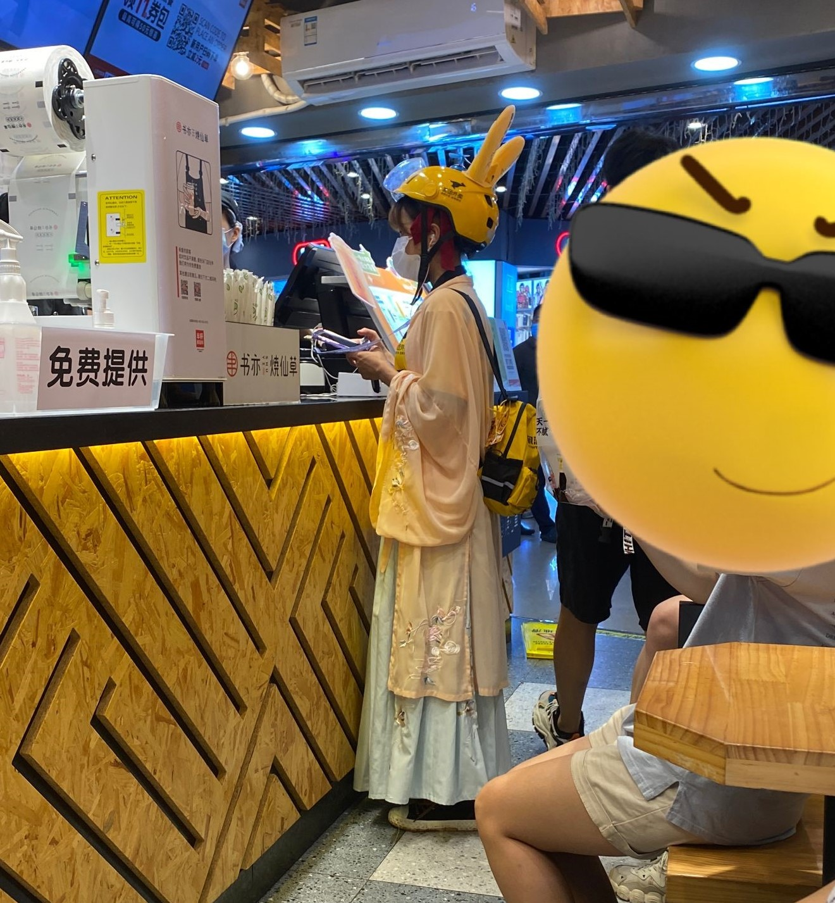

#### 2021-8-26 阵雨转阴
> 今天天气很凉快，很舒服。要审的论文看完了，回来之后洗了衣服，现在坐在桌子前慢慢地写点东西，心里感觉是一种带着低气压的轻快。
 

> 停了一会，脑子又开始乱了，什么事情也想不了。我想我是该睡觉了。

  

#### 2021-8-27 阵雨
> 午休时间到了

> 凌晨1：35分，审稿意见只剩最后一条了，明天再写吧。
>
>又是一个周六，马上要开学了，实验室里人多了起来，那种已经不太熟悉的安静和沉闷又来了。

 

>开学就是研二了，我不想面对未来。

  

#### 2021-8-28 阴
>毛利小姐的辅导员梦被人情社会中的关系户重重的冲击了一下，于是我们开始一起思考起未来。

 

>毛利小姐说的一句话，我也想知道答案。 “以后会是什么样子呀”
>
> 希望不会太差吧。

##### 2021 夏 备注

>这个夏天应该算是很特别的一个夏天。  第一次没有回家过暑假，再也没有正经的课堂和考试，更加接近毕业和工作，找到了一起打球一起弱智的朋友。  之前计划的事情很多还没有做，但好像也就此结束了。

#### 2021-8-30
>没有老板问候，不用担心工作的假期真的来了，虽然晚了一点，总归没有好。 但，像是周日的晚上。

 

> **PS:**  在商场见到的一个美团派送员，不知道是真的还是假的，觉得很可爱所以偷拍了一下。

  

  

>对了，今天太阳很大，照进了实验室。我的桌子也因此得到恩赐，到达了它桌生的小巅峰。

  

 

> Enjoy your life

#### 2021-9-1
>音乐有时候会引导心情，有时候会依附于心情。 心情有时候会引导人的行为，有时候会依附于人的行为。 别人的行为有时候会引导我，有时候会依附于我。 我不一样，我是傻逼，任何时候。